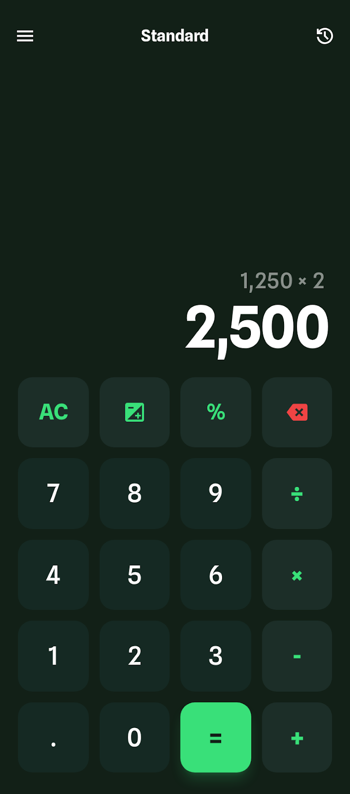

# go-calc

使用 Gio GUI 库实现的跨平台计算器应用，验证如何从设计稿件到功能调试完成，体现AI在编程中是否真的有效。

## 功能特性

- 基本的四则运算（加、减、乘、除）
- 清除功能（C：清除所有，CE：清除当前输入）
- 退格功能（⌫）
- 正负号切换（±）
- 小数点支持
- 现代化的 Material Design 界面



## 依赖要求

- Go 1.21 或更高版本

## 安装和运行

1. 克隆或下载项目后，进入项目目录

2. 安装依赖：
```bash
go mod tidy
```

3. 运行应用：
```bash
go run main.go
```

## 使用方法

- 点击数字按钮输入数字
- 点击运算符按钮（+、-、×、÷）选择运算
- 点击等号（=）执行计算
- 点击 C 清除所有数据和运算
- 点击 CE 清除当前输入
- 点击 ⌫ 删除最后一位数字
- 点击 ± 切换正负号

## 环境安装

### Ubuntu 

```bash
apt install gcc pkg-config libwayland-dev libx11-dev libx11-xcb-dev libxkbcommon-x11-dev libgles2-mesa-dev libegl1-mesa-dev libffi-dev libxcursor-dev libvulkan-dev

```

### Windows

```bash
nothing need to install
```

### Mac

```bash
Xcode is required for Apple platforms.
```

## 构建可执行文件

### Windows
```bash
go build -ldflags="-H windowsgui" -o calculator.exe main.go
```

### Linux/macOS
```bash
go build -o calculator main.go
```

### Android or other
```
TODO
```